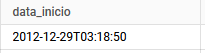
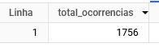
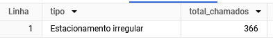
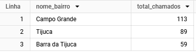
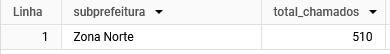
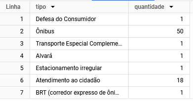
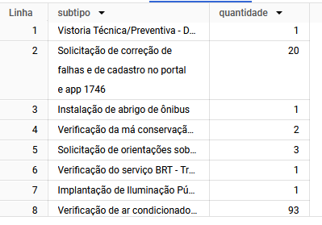
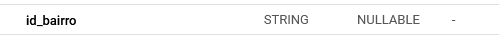
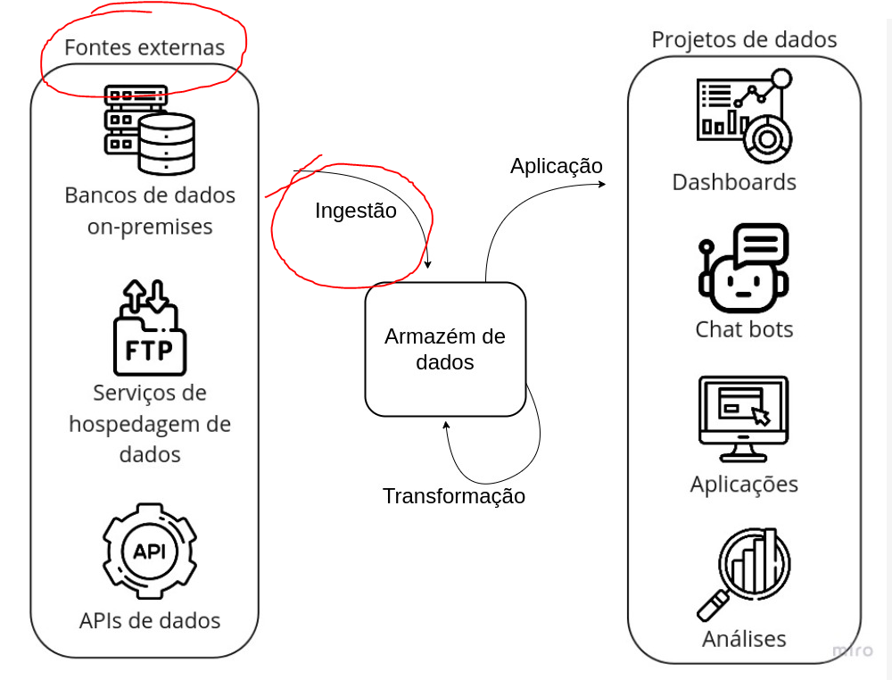

# Desafios 1-5

Resolução dos desafios 1-5.

## Questão 1

### Quantos chamados foram abertos no dia 01/04/2023?

Para responder a essa pergunta, apenas precisei contar o numero total de ocorrencias registradas no dia 01/04/2023 usando a função `COUNT(*)` e filtrando a data de abertura dos chamados.

Me deparei com um problema de formatação de data, então precisei usar a função `DATE()` para extrair apenas a data e comparar com a data desejada.



```sql
SELECT COUNT(*) AS total_ocorrencias
FROM
    `datario.adm_central_atendimento_1746.chamado`
WHERE
    DATE(data_inicio) = "2023-04-01";
```
### Resposta



## Questão 2

### Qual o tipo de chamado que teve mais teve chamados abertos no dia 01/04/2023?

Para responder a essa pergunta, utilizei `GROUP BY` por tipo e contei o numero total de chamados de cada tipo, ordenando de forma decrescente e `LIMIT` a 1 resultado para obter o tipo com mais chamados.

```sql
SELECT tipo, COUNT(*) AS total_chamados
FROM
    `datario.adm_central_atendimento_1746.chamado`
WHERE
    DATE(data_inicio) = "2023-04-01"
GROUP BY
    tipo
ORDER BY total_chamados DESC
LIMIT 1;
```
### Resposta



## Questão 3

### Quais os nomes dos 3 bairros que mais tiveram chamados abertos nesse dia?

Como na tabela de chamados o bairro é representado por um id, não é possivel obter o nome do bairro diretamente.

Entao precisei fazer um `JOIN` com a tabela de bairros para obter o nome do bairro e agrupar os chamados por bairro, contando o numero total de chamados de cada bairro, ordenando de forma decrescente e limitando a 3 resultados para obter os 3 bairros com mais chamados.

```sql
SELECT b.nome AS nome_bairro, COUNT(c.id_bairro) AS total_chamados
FROM
    `datario.adm_central_atendimento_1746.chamado` c
    JOIN `datario.dados_mestres.bairro` b ON c.id_bairro = b.id_bairro
WHERE
    DATE(c.data_inicio) = "2023-04-01"
GROUP BY
    b.nome
ORDER BY total_chamados DESC
LIMIT 3;
```
### Resposta



## Questão 4

### Qual o nome da subprefeitura com mais chamados abertos nesse dia?

Utilizando a mesma lógica da questão anterior, fiz um `JOIN` com a tabela de bairros para obter o nome da subprefeitura e agrupei os chamados por subprefeitura ao inves de por nome do bairro, contando o numero total de chamados de cada subprefeitura, ordenando de forma decrescente e limitando a 1 resultado para obter a subprefeitura com mais chamados.

```sql
SELECT b.subprefeitura, COUNT(c.id_bairro) AS total_chamados
FROM
    `datario.adm_central_atendimento_1746.chamado` c
    JOIN `datario.dados_mestres.bairro` b ON c.id_bairro = b.id_bairro
WHERE
    DATE(c.data_inicio) = "2023-04-01"
GROUP BY
    b.subprefeitura
ORDER BY total_chamados DESC
LIMIT 1;
```
### Resposta



## Questão 5

### Existe algum chamado aberto nesse dia que não foi associado a um bairro ou subprefeitura na tabela de bairros? Se sim, por que isso acontece?

Essa questão tive mais dificuldade para resolver, por se tratar de uma questão interpretativa e exploratória.

A primeira pergunta da questão podemos facilmente responder com uma consulta simples, verificando se existe algum chamado que não foi associado a um bairro ou subprefeitura.

Utilizando de um `LEFT JOIN` para trazer todos os chamados e verificar se o id do bairro é nulo, ou seja, não foi associado a um bairro.

```sql
SELECT c.*
FROM
    `datario.adm_central_atendimento_1746.chamado` c
    LEFT JOIN `datario.dados_mestres.bairro` b ON c.id_bairro = b.id_bairro
WHERE
    DATE(c.data_inicio) = "2023-04-01"
    AND b.id_bairro IS NULL;
```


Explorando um pouco as similaridades entre os chamados que não foram associados a um bairro, percebi que todos os chamados que não foram associados a um bairro possuem uma forte correlação com o tipo de chamado "Onibus" e "Atendimento ao Cidadão".

```sql
SELECT 
    c.tipo, 
    COUNT(*) AS quantidade
FROM
    `datario.adm_central_atendimento_1746.chamado` c
    LEFT JOIN `datario.dados_mestres.bairro` b ON c.id_bairro = b.id_bairro
WHERE
    DATE(c.data_inicio) = "2023-04-01"
    AND b.id_bairro IS NULL
GROUP BY 
    c.tipo;
```



Especificamente em subtipos especificos também

```sql
SELECT 
    c.subtipo, 
    COUNT(*) AS quantidade
FROM
    `datario.adm_central_atendimento_1746.chamado` c
    LEFT JOIN `datario.dados_mestres.bairro` b ON c.id_bairro = b.id_bairro
WHERE
    DATE(c.data_inicio) = "2023-04-01"
    AND b.id_bairro IS NULL
GROUP BY 
    c.subtipo;
```


Fazendo comparitivo com outro dia aleatorio do mesmo mes, percebi que a quantidade de chamados sem bairro associado com os mesmos subtipos são semelhantes.

```sql
SELECT 
    c.subtipo, 
    COUNT(*) AS quantidade
FROM
    `datario.adm_central_atendimento_1746.chamado` c
    LEFT JOIN `datario.dados_mestres.bairro` b ON c.id_bairro = b.id_bairro
WHERE
    DATE(c.data_inicio) = "2023-04-03"
    AND b.id_bairro IS NULL
GROUP BY 
    c.subtipo;
```



Verificando o Schema da tabela de chamados, percebi que o campo `id_bairro` é NULLABLE, ou seja, não é obrigatório informar o bairro do chamado.
Não sei se posso levar em consideração essa informação pois todos os outros campos estão tabem como NULLABLE.

Porém com isso posso inferir que não seja obrigatório informar o bairro do chamado em alguns casos onde nao seja relevante.




Explorando um pouco além, na documentação da infraestrutura do banco de dados, percebi que os dados são obtidos de fontes externas. Assim tendo uma pequena chance de os dados não serem completos ou se perderam na etapa da ingestão, o que pode explicar a falta de informação em alguns chamados.




