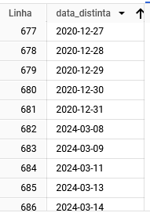
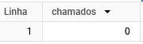
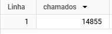
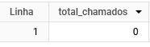

# Desafios 6-10

Resolução dos desafios 6-10.

### <span style={{color: "red", fontWeight: "bold"}}>A partir da questão 6 nao obtive nenhum resultado, me levando a crer que fiz algo errado no bigquery <i>(primeira vez utilizando) </i> porem escrevi as queries substituindo por outros dados para verificar se elas eram funcionais</span>

Para verificar se no banco de dados realmente nao existiam chamados no periodo especificado, fiz uma consulta para verificar quais data distintas existiam com o subtipo "Perturbação do sossego".

Ordenei de forma decrescente para verificar se existiam dados no intervalo especificado e nao constava nenhum dado.

```sql
SELECT DISTINCT DATE(data_inicio) AS data_distinta
FROM
    `datario.adm_central_atendimento_1746.chamado`
WHERE subtipo = "Perturbação do sossego"
```



## Questão 6

### Quantos chamados com o subtipo "Perturbação do sossego" foram abertos desde 01/01/2022 até 31/12/2023 (incluindo extremidades)?

Fiz uma simples contagem de chamados com o subtipo "Perturbação do sossego" entre as datas especificadas.
Fiquei um bom tempo tentando entender o motivo de não obter resultados, porem ao substituir por outras datas, percebi que a query estava correta. 
Ou seja, creio que nao tenha mais nenhum chamado com o subtipo "Perturbação do sossego" entre as datas especificadas na questão.

```sql
SELECT count(*) as chamados
FROM
    `datario.adm_central_atendimento_1746.chamado`
WHERE
    subtipo = "Perturbação do sossego"
    AND (
        DATE(data_inicio) BETWEEN "2022-01-01" AND "2023-12-31"
    );
```



substiuindo as datas por outras `2022-01-01` e `2023-12-31`, obtive resultados.

```sql
SELECT count(*) as chamados
FROM
    `datario.adm_central_atendimento_1746.chamado`
WHERE
    subtipo = "Perturbação do sossego"
    AND (
        DATE(data_inicio) BETWEEN "2022-01-01" AND "2023-12-31"
    );
```




## Questão 7

### Selecione os chamados com esse subtipo que foram abertos durante os eventos contidos na tabela de eventos (Reveillon, Carnaval e Rock in Rio).

Para essa questão fiz um `JOIN` com a tabela de eventos para obter os chamados com o subtipo "Perturbação do sossego" que foram abertos durante os eventos especificados.
Como se tratava de um `JOIN` com outra tabela, nao consegui substituir os dados para verificar se a query estava correta.

```sql
SELECT COUNT(*) AS total_chamados
FROM
    `datario.adm_central_atendimento_1746.chamado` c
    INNER JOIN `datario.turismo_fluxo_visitantes.rede_hoteleira_ocupacao_eventos` e ON (
        DATE(c.data_inicio) BETWEEN e.data_inicial AND e.data_final
    )
WHERE
    c.subtipo = "Perturbação do sossego";
```




## Questão 8

### Quantos chamados desse subtipo foram abertos em cada evento?

Para essa questão utilizei a mesma lógica da questão anterior, porem agrupei os chamados por evento para obter o total de chamados de cada evento.

```sql
SELECT e.evento, COUNT(c.id_chamado) AS total_chamados
FROM
    `datario.adm_central_atendimento_1746.chamado` c
    INNER JOIN `datario.turismo_fluxo_visitantes.rede_hoteleira_ocupacao_eventos` e ON (
        DATE(c.data_inicio) BETWEEN e.data_inicial AND e.data_final
    )
WHERE
    c.subtipo = "Perturbação do sossego"
GROUP BY
    e.evento
ORDER BY total_chamados DESC;
```


## Questão 9

### Qual evento teve a maior média diária de chamados abertos desse subtipo?

Nesta questão tive um pouco mais de dificuldade na logica de calculo da média diária de chamados.
Na primeira tentativa tentei usar a função `AVG` para calcular a média diária, porem percebi que a função `AVG` calcula a média de todos os chamados e não a média diária.

Entao tentei usar a função `DATEDIFF` para calcular a diferença de dias entre a data inicial e final do evento, porem a função `DATEDIFF` não estava disponível no BigQuery.

Entao buscando na internet encontrei a função `DATE_DIFF` que faz a mesma coisa que a função `DATEDIFF` do SQL Server. [Difference between two dates in dates using Google bigquery?](https://stackoverflow.com/questions/50351517/difference-between-two-dates-in-dates-using-google-bigquery).

Foi necessario adicionar um `+1` no final da função `DATE_DIFF` para calcular a média diária corretamente. Pois a função `DATE_DIFF` retorna a diferença de dias entre as datas, porem não inclui a data final.

Precisei fazer um subquery para calcular a diferença de dias entre a data inicial e final do evento e depois calcular a média diária de chamados. 

```sql
SELECT subquery.evento, SUM(subquery.total_chamados) / (
        DATE_DIFF (
            MAX(subquery.data_fim), MIN(subquery.data_inicio), DAY
        ) + 1
    ) AS media_diaria
FROM (
        SELECT
            e.evento, DATE(c.data_inicio) AS data_inicio, DATE(c.data_fim) AS data_fim, COUNT(c.id_chamado) AS total_chamados
        FROM
            `datario.adm_central_atendimento_1746.chamado` c
            INNER JOIN `datario.turismo_fluxo_visitantes.rede_hoteleira_ocupacao_eventos` e ON (
                DATE(c.data_inicio) BETWEEN e.data_inicial AND e.data_final
            )
        WHERE
            c.subtipo = "Perturbação do sossego"
        GROUP BY
            e.evento, data_inicio, data_fim
    ) AS subquery
GROUP BY
    subquery.evento
ORDER BY media_diaria DESC
LIMIT 1;
```

## Questão 10 

### Compare as médias diárias de chamados abertos desse subtipo durante os eventos específicos (Reveillon, Carnaval e Rock in Rio) e a média diária de chamados abertos desse subtipo considerando todo o período de 01/01/2022 até 31/12/2023.

Para essa questão precisei adotar uma abordagem diferente, pois não consegui calcular a média diária de chamados abertos durante os eventos específicos e a média diária de chamados abertos desse subtipo considerando todo o período de 01/01/2022 até 31/12/2023 em uma única query.

Então fiz duas subqueries, uma para calcular a média diária de chamados abertos durante os eventos específicos e outra para calcular a média diária de chamados abertos desse subtipo considerando todo o período de 01/01/2022 até 31/12/2023.

Depois fiz um `SELECT` para comparar as médias diárias de chamados abertos durante os eventos específicos e a média diária de chamados abertos desse subtipo considerando todo o período de 01/01/2022 até 31/12/2023.

Como não obtive resultados, nao consegui extrair informaçoões para comparar.
Porém acredito que com os dados retornado poderiamos extrair insights se em epocas de eventos a quantidade de chamados aumenta ou diminui.

Há formas de fazer mais eficiente, porem minha falta de conhecimento aprofundado em SQL me limitou a fazer de forma mais verbosa e menos eficiente.

```sql
WITH
    media_eventos AS (
        SELECT subquery.evento, SUM(subquery.total_chamados) / (
                DATE_DIFF (
                    MAX(subquery.data_fim), MIN(subquery.data_inicio), DAY
                ) + 1
            ) AS media_diaria
        FROM (
                SELECT
                    e.evento, DATE(c.data_inicio) AS data_inicio, DATE(c.data_fim) AS data_fim, COUNT(c.id_chamado) AS total_chamados
                FROM
                    `datario.adm_central_atendimento_1746.chamado` c
                    INNER JOIN `datario.turismo_fluxo_visitantes.rede_hoteleira_ocupacao_eventos` e ON (
                        DATE(c.data_inicio) BETWEEN e.data_inicial AND e.data_final
                    )
                WHERE
                    c.subtipo = "Perturbação do sossego"
                GROUP BY
                    e.evento, data_inicio, data_fim
            ) AS subquery
        GROUP BY
            subquery.evento
    ),
    media_total AS (
        SELECT COUNT(*) / (
                DATE_DIFF (
                    DATE '2023-12-31', DATE '2022-01-01', DAY
                ) + 1
            ) AS media_diaria
        FROM datario.adm_central_atendimento_1746.chamado
        WHERE
            subtipo = 'Perturbação do sossego'
            AND DATE(data_inicio) BETWEEN '2022-01-01' AND '2023-12-31'
    )
SELECT
    media_eventos.evento AS evento,
    media_eventos.media_diaria AS media_diaria_evento,
    media_total.media_diaria AS media_diaria_total
FROM media_eventos, media_total;
```
